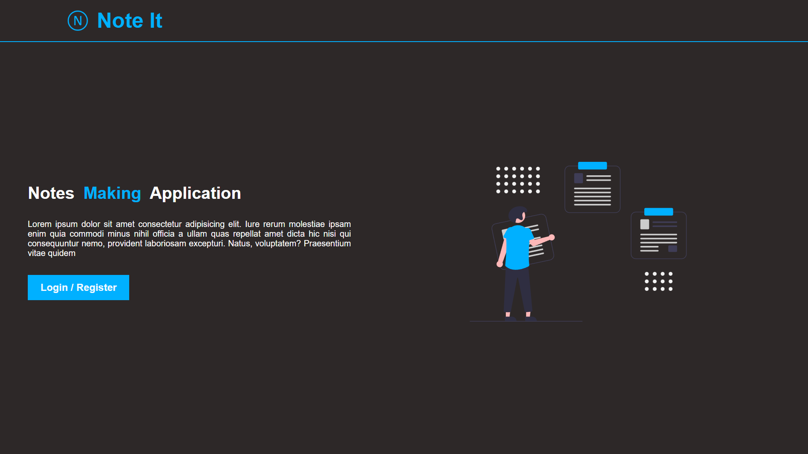

# NoteIt <a href="https://notes-app-bo24.onrender.com" style="font-size:1rem;margin-left:2rem">Live Site</a>
It is a fullstack Notes App, powered by the MERN (MongoDB, Express.js, React, Node.js) stack! This application offers a seamless and intuitive experience for managing your notes with robust CRUD (Create, Read, Update, Delete) operations.

## Features:

### 1. Create Notes
Effortlessly jot down your thoughts, ideas, and important information. The app allows you to create new notes with ease, ensuring a streamlined note-taking experience.

### 2. Read Notes
Access your notes anytime, anywhere. The Read operation enables you to view and review your notes whenever you need them, fostering efficient organization and retrieval.

### 3. Update Notes
Stay in control of your information. The Update operation empowers you to modify and refine your notes as your thoughts evolve, ensuring that your notes are always current.

### 4. Delete Notes
Declutter your space effortlessly. The Delete operation lets you remove unwanted or outdated notes, keeping your collection organized and relevant.

### 5. Email Verification
Security is paramount. Our app includes a robust email verification system to ensure that your account remains secure. Upon registration, a verification email will be sent to your registered email address, adding an extra layer of protection to your account.

